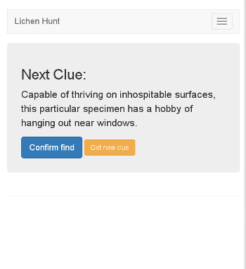
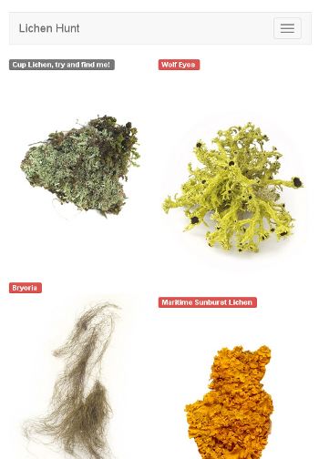

# Battle of the Code 2015 submission
## Lichen Hunt

This mobile web app guides users through a scavanger hunt for various lichen-based art installations in Kansas City.

Technologies:

* Python
* Flask
* SQLAlchemy
* Bootstrap

Screenshots:

The license for this project can be found in LICENSE.  All images and the setup.py script are not covered by the license.
